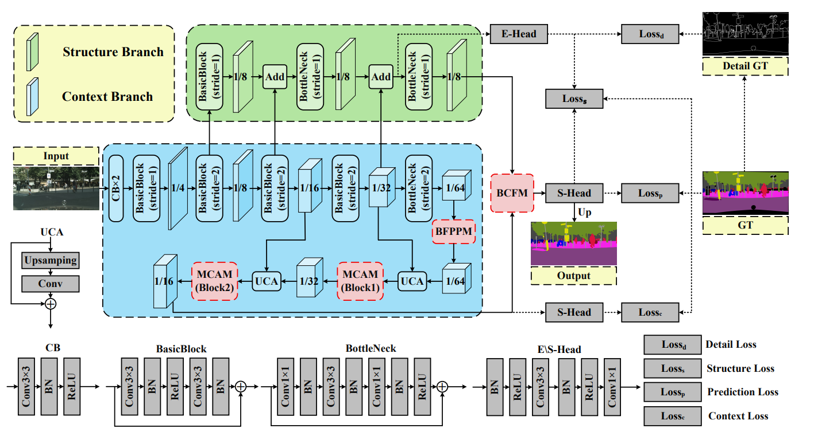
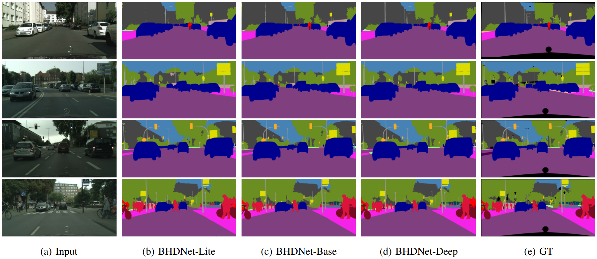
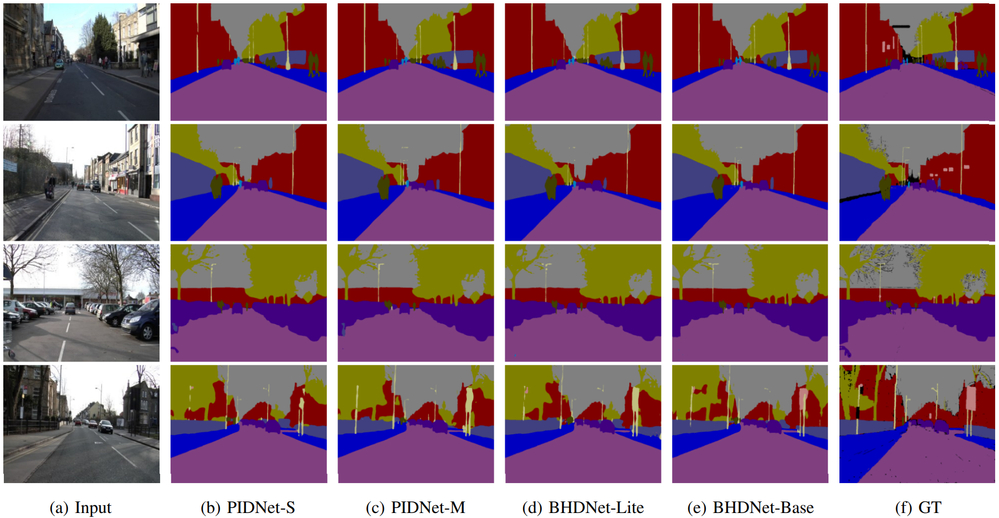

# BHDNet: Bilateral Hierarchical Decoding Network for Real-Time Semantic Segmentation

[](https://opensource.org/licenses/MIT)

## Introduction

BHDNet is a highly efficient bilateral hierarchical decoding network designed for real-time semantic segmentation.


## Overview

Balancing segmentation accuracy with inference speed remains a formidable challenge in real-time autonomous driving scenarios. Existing approaches often suffer from irreversible detail degradation caused by repeated downsampling, and the inherent distribution gap between high-level contextual semantics and low-level structural details.

To address these limitations, we propose the **Bilateral Hierarchical Decoding Network (BHDNet)**. Specifically, we introduce the **Bidirectional Factorized Pyramid Pooling Module (BFPPM)** to overcome the limitations of traditional pooling and efficiently capture multi-scale anisotropic context. Furthermore, to effectively bridge the gap between high-level semantics and fine-grained details, we propose the **Bilateral Complementary Fusion Module (BCFM)** and the **Multi-scale Channel Aggregation Module (MCAM)**. Utilizing Triplet Cross-dimensional Gated Attention (TCGA), BCFM harmonizes the heterogeneous representations, ensuring precise spatio-channel feature recalibration.

## Datasets

### Setup Instructions

1. Download the [Cityscapes](https://www.cityscapes-dataset.com/) and [CamVid](http://mi.eng.cam.ac.uk/research/projects/VideoRec/CamVid/) datasets.
2. Unzip them into the following directories:
   - `data/cityscapes`
   - `data/camvid`
3. Verify that the paths in `data/list` match your dataset image locations.

## Results

### Cityscapes Dataset

| Method | Pretrain | mIoU (%) | FPS (torch) |
|:---:|:---:|:---:|:---:|
| **BHDNet-Lite** | No | 77.0 | 144.1 |
| **BHDNet-Base** | No | 77.9 | 57.2 |
| **BHDNet-Deep** | No | 79.1 | 44.0 |
| **BHDNet-Lite** | ImageNet | 79.0 | 144.1 |
| **BHDNet-Base** | ImageNet | 80.0 | 57.2 |
| **BHDNet-Deep** | ImageNet | **80.5** | 44.0 |

### CamVid Dataset

| Method | Pretrain | mIoU (%) | FPS (torch) |
|:---:|:---:|:---:|:---:|
| **BHDNet-Lite** | No | 73.1 | 174.1 |
| **BHDNet-Base** | No | 74.8 | 93.3 |
| **BHDNet-Lite** | Cityscapes | 81.0 | 174.1 |
| **BHDNet-Base** | Cityscapes | **83.5** | 93.3 |

## Visualizations

We provide qualitative visualization results to demonstrate the superior performance of **BHDNet** in complex urban driving scenarios.
### Cityscapes Results


### CamVid Results


## Key Features

- **Multiple Model Variants**: Lite, Base, and Deep versions to balance accuracy and speed.
- **Real-time Inference**: High-speed processing for practical applications.

## Installation

```bash
# Install dependencies
pip install -r requirements.txt
